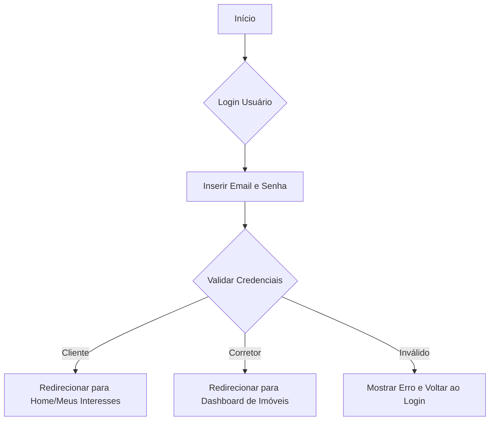
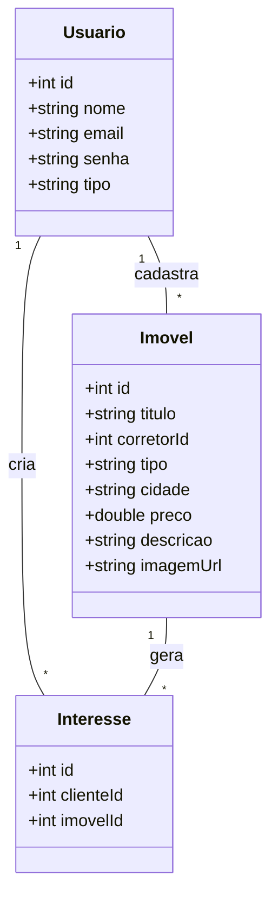

# Imobiliária Prime — Escopo do Projeto

**Resumo**
Plataforma web em Angular que permite a corretores de imóveis cadastrarem e gerenciarem anúncios, e a clientes pesquisarem imóveis e manifestarem interesse, com autenticação e autorização baseada em perfis.

---

## Objetivos

* Criar uma plataforma SPA para conectar clientes e corretores.
* Permitir cadastro e login para clientes.
* Permitir que corretores gerenciem seus imóveis (CRUD completo).
* Clientes podem marcar imóveis como “Tenho Interesse” e listar seus favoritos.
* Página inicial pública com destaques.

---

## Recursos do Projeto

* **Frontend:** Angular
* **Estilização:** SCSS
* **Backend simulado:** JSON Server (`db.json`)
* **Protótipo UI:** Figma
* **IDE:** VS Code
* **Documentação / Diagramas:** Mermaid (no documento abaixo)

---

## Requisitos

### Requisitos Funcionais (RF)

1. RF01 — Usuário cliente deve se registrar com e‑mail e senha.
2. RF02 — Usuários (clientes e corretores) devem efetuar login/logout.
3. RF03 — Página inicial pública deve listar imóveis em destaque.
4. RF04 — Cliente deve poder buscar imóveis por palavra-chave.
5. RF05 — Cliente deve poder marcar imóvel como “Tenho Interesse”.
6. RF06 — Cliente deve poder listar imóveis marcados como “Tenho Interesse”.
7. RF07 — Corretor deve poder criar, editar, listar e excluir seus próprios imóveis.
8. RF08 — Corretor deve poder ver a lista de clientes interessados em seus imóveis.

### Requisitos Não Funcionais (RNF)

1. RNF01 — Autenticação simples via JSON Server (simulação).
2. RNF02 — Aplicação responsiva.
3. RNF03 — Guardas de rota para proteger áreas restritas.
4. RNF04 — Boas práticas de UX: feedback visual em ações.
5. RNF05 — Estrutura clara de código Angular (módulos, serviços, guards).

---

## Modelos / Entidades

### Usuário

* `id: number`
* `nome: string`
* `email: string`
* `senha: string`
* `tipo: string` ("cliente" | "corretor")

### Imóvel

* `id: number`
* `titulo: string`
* `corretorId: number`
* `tipo: string`
* `cidade: string`
* `preco: number`
* `descricao: string`
* `imagemUrl: string`

### Interesse

* `id: number`
* `clienteId: number`
* `imovelId: number`

---

## Estrutura de Dados (db.json)

```json
{
  "usuarios": [
    { "id": 1, "nome": "Carlos Corretor", "email": "corretor@prime.com", "senha": "123", "tipo": "corretor" },
    { "id": 2, "nome": "Ana Cliente", "email": "cliente@email.com", "senha": "123", "tipo": "cliente" }
  ],
  "imoveis": [
    {
      "id": 1,
      "titulo": "Apartamento com vista para o mar",
      "corretorId": 1,
      "tipo": "Apartamento",
      "cidade": "Santos",
      "preco": 750000,
      "descricao": "Lindo apartamento com 3 quartos...",
      "imagemUrl": "url_da_imagem.jpg"
    }
  ],
  "interesses": [
    { "id": 1, "clienteId": 2, "imovelId": 1 }
  ]
}
```

---

## Estrutura de pastas sugerida (Angular)

```
/src/app
  /core
    /guards
      auth.guard.ts
      corretor.guard.ts
    /services
      auth.service.ts
      imoveis.service.ts
      notificacao.service.ts
    /models
  /views
    /public
      /home
      /busca-imoveis
    /cliente
      /meus-interesses
    /corretor
      /dashboard-imoveis
  /templates
    /components
      /navbar
      /footer
      /card-imovel
    /pipes
```

---

## Casos de Uso (resumido)

* **Registrar-se (Cliente)**: Insere dados → salvo em `usuarios` → login.
* **Login (Cliente/Corretor)**: Autentica pelo JSON Server → redireciona para rota por perfil.
* **Buscar Imóveis**: Cliente digita termo → lista filtrada.
* **Marcar Interesse**: Cliente salva em `interesses` → aparece em “Meus Interesses”.
* **Dashboard Corretor**: CRUD de imóveis, visualizar interessados.

---

## Diagramas (Mermaid)

### Fluxo: Login e Redirecionamento



### Diagrama de Classes



---

## Protótipos / Telas mínimas

1. Tela de login (cliente/corretor).
2. Tela de registro de cliente.
3. Página inicial com destaques.
4. Busca de imóveis.
5. Detalhes do imóvel.
6. Área do cliente: “Meus Interesses”.
7. Dashboard do corretor: CRUD de imóveis.

---

## Plano de Aulas / Etapas de Entrega (sugestão)

* Aula 1: Setup Angular + JSON Server + AuthService.
* Aula 2: Implementar login/logout, guards de rota.
* Aula 3: Criar componentes de busca e detalhes do imóvel.
* Aula 4: Implementar CRUD de imóveis (corretor).
* Aula 5: Implementar “Meus Interesses” (cliente).
* Aula 6: Refinar UI (Figma → Angular), testes e apresentação.

---

## Checklist de Entrega

* [ ] Autenticação (cliente/corretor)
* [ ] Página inicial e busca
* [ ] CRUD imóveis (corretor)
* [ ] Meus Interesses (cliente)
* [ ] Protótipo Figma + telas implementadas
* [ ] Documentação e diagramas (este documento)
